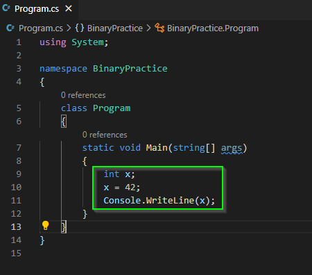
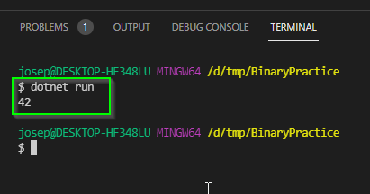
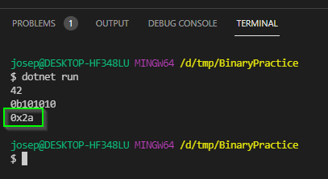
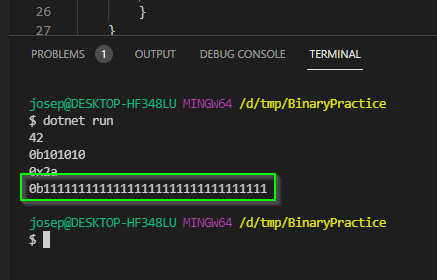

# Binary Numbers in C#

In this activity, you will use C#'s `Convert` utility to explore how computers
store 32-bit integers. By the end of this activity you should understand:

1. How to convert `int` values between binary, decimal, and hexadecimal
   representations.
2. Understand how positive and negative integers are represented in binary.
3. Understand the difference between Overflow and Underflow errors.

- [Binary Numbers in C](#binary-numbers-in-c)
  - [Setting up Repository](#setting-up-repository)
    - [Make a copy of this repository](#make-a-copy-of-this-repository)
    - [Add Mx. Collard as a Collaborator](#add-mx-collard-as-a-collaborator)
    - [Add a Development Branch](#add-a-development-branch)
    - [Push your branch to GitHub](#push-your-branch-to-github)
    - [Create a new C# Project](#create-a-new-c-project)
    - [Create a Pull Request](#create-a-pull-request)
  - [Converting integers to Binary and Hex](#converting-integers-to-binary-and-hex)
    - [Knowledge Check](#knowledge-check)
  - [Negative Integers](#negative-integers)
    - [Knowledge Check](#knowledge-check-1)
  - [Negative Integers in C](#negative-integers-in-c)
  - [Overflow and Underflow Errors](#overflow-and-underflow-errors)
    - [Knowledge Check](#knowledge-check-2)
  - [Submit your Work](#submit-your-work)

## Setting up Repository

### Make a copy of this repository

Start by making a copy of this repository.

1. Click the `Use this template` button on the main repository:


2. Name your repository `XXXXXX-BinaryNumbersInCSharp`, replacing the `XXXXXX`
   with your the first part of your email. (This is so I can easily find it
   later.)
3. You may make your repository public **or** private.
4. You do **not** need to include all of the branches


### Add Mx. Collard as a Collaborator

For grading purposes, you need to add me to your repository so I can see your
work.

1. On the copied repository go to the settings tab


2. On the settings page, select the `Manage Access` option on the left.


3. On the manage access page, select `Add people`


4. Search for `jcollard` and add me as a collaborator.

### Add a Development Branch

With the exception of the group project, we have mostly been working on the
`main` branch of our repositories. This is considered poor practice. The `main`
branch is typically reserved for completed work on projects. A secondary branch
called `develop` is typically created where you can work without fear of
"polluting" the `main` branch.

1. Using GitHub Desktop, Clone your new repository.
2. Open your project in Visual Studio Code
3. Use the command palette (Command + Shift + P) to run `Git: Create Branch`


4. Name your branch `develop`


### Push your branch to GitHub

By default, a new branch is created locally on your computer (not published). To
ensure your work is visible, you need to push your repository to GitHub.

1. Use the command palette to run `Git: Push`


2. You will likely be prompted that your branch is not published. Select `Okay`
   to publish the branch.


### Create a new C# Project

Let's start by creating a new C# project in this repository.

Before continuing, verify that you are on your `develop` branch. You can see
which branch you are on by looking in the bottom left corner of Visual Studio
Code.


1. Clone and open this project in Visual Studio Code
2. In Visual Studio Code, open a new Terminal
   * From the top menu select Terminal > New Terminal


4. In the terminal, run the command `dotnet new console`


If all went well, you should now see several project files in your package
explorer.


5. Open the `Program.cs` file. This file contains a simple "Hello World" program
   you can run.


6. Run the project by executing `dotnet run` in your terminal.


### Create a Pull Request

Next, you will push your base project to GitHub and create a Pull Request that
will allow Mx. Collard (and yourself) to see the changes that have been made to
this project.

1. Commit your work. 
   * Your commit message should be something like `chore: Initialize project`
2. Push your work
3. In your web browser, visit your repository
4. Select the `Pull Request` tab


5. Select the `New Pull Request` button


6. Select that you would like to pull your `develop` into your `main` branch.


7. Select `Create Pull Request`


8. Next add `jcollard` as a reviewer.


9. Finally, click `Create Pull Request`


## Converting integers to Binary and Hex

An integer is a whole number: 0, 5, 9, -72. An integer cannot store a number
that is requires a fractional representation. For example: 2.5, -3.999, and 72.7
are not integers.

Previously, you created integers in C# using the `int` variable type. Let's go
ahead and make an `int` variable called `x` now and assign it the value `42`.

1. Update the main method your Program.cs file to create an `int x`, assign it
   the value `42` and then write that value to the terminal.



2. Next, run your program in the terminal. If all goes well, you will see the
   number `42` displayed.



The `int` data type in C# uses 32-bits to store data. C# provides a `Convert`
utility that can show the binary representation of a number. Let's test this out
now:

3. Update your code to convert `x` to a `string` representing the binary version
   of `x`;


4. Run your program to see the binary version of `x`.


Notice that the binary number truncates the leading 0s. `x` is in fact 32-bits
long inside of the computer.

The `Convert` utility can also convert the number to a hexadecimal number.

5. Update your code to convert `x` to a `string` representing the hexadecimal
   version of `x`.


6. Run your program to see the hex version of `x`.



### Knowledge Check

Answer the following question in your copy of the `README.md` file.

Which of the following are integers:

   * "hello" | ADD ANSWER HERE
   * 17.5 | ADD ANSWER HERE
   * 60009
   * 22333
   * -33.5f
   * 'c'
   * 0x5723
   * 0b10101010
   * -42


## Negative Integers

So far, we have mostly seen and discussed positive integers. But what if we want
to represent negative values? To do this, we use what is called a **signed
integer**. A signed integer uses one of its bits to track if the number is
positive or negative. In all modern computers, we use the largest bit to do
this. 

For example, if we have an 8 bit number, the largest bit (left most) tracks the
sign of the integer and the remaining 7 bits track the value.

```
The following is an 8-bit signed integer:

0b0000_0000
  ^
  |
  The larget bit tracks the sign 
  0 means it is positive and 1 means it is negative
```

The following are all negative 8-bit signed integers:

* `0b1000_0000`
* `0b1000_1010`
* `0b1111_1111`

This means that, in an 8-bit integer, we have `2^7 - 1` positive values (0 is
not positive) and `2^7` negative values. We additionally have `2^8` total
possible values (we include 0).

### Knowledge Check

Answer the following question in your copy of the `README.md` file.

* How many positive values can be represented in a 6-bit signed integer?

ADD ANSWER HERE

* How many negative values can be represented in a 12-bit signed integer?

ADD ANSWER HERE


* How many values can be represented in a 9-bit signed integer?

ADD ANSWER HERE

* Each of the following numbers are 8-bit signed integers. For each, convert 
  them to binary then specify if it is positive or negative (you do not need to
  calculate the decimal value).

  * `0xAB` - BINARY HERE - IS POSITIVE HERE?
  * `0xFD` 
  * `0xF1`
  * `0xBD`
  
## Negative Integers in C#

The `int` data type in C# is a 32-bit signed integer which means it can store
both positive and negative values.

We can test this out by creating a negative int and converting it to binary:

1. Update your code to have an `int y` and assign it the value -1.
2. Convert `y` to binary.
3. Write the result to the console.


4. Run your program to see the binary version of `y`.



If you count the number of digits, you will find that there are 32-bits in this
number.

We represent negative numbers this way to make math work identical to positive
numbers. If you decrease `y` by one, you will get `-2`. Which, in binary, simply
reduces the right most bit by 1.

5. Add a value `z` to your program and assign it to be `y -1`.
6. Convert `z` to binary.
7. Write the result to the console.


8. Run your program to see the binary version of `z`


Notice, the right most bit is 0. This is because the number was decreased by 1.

## Overflow and Underflow Errors

Because `int` values use 32-bits of data, we have a finite number of values we
can represent. In this case, 2^32 possibilities. 2^31 of them are positive and
the other 2^31 are negative.

The maximum positive integer is `2^31 - 1` and the minimum negative integer is
`-2^31`. C# provides a quick constant for accessing these values.

1. Update your code to print `int.MaxValue` and `int.MinValue`.


2. Run your program to see the result.


3. Update your code to convert the max and min values to binary and print write
   them to the console.


4. Run your program to see the result.


If you were to count the number of digits, you would find that `int.MaxValue`
contains 31 digits (the 32nd bit is a leading zero that is not shown).
Similarly, `int.MinValue` contains 32 digits.

Notice, that `int.MinValue` is equivalent to adding 1 to `int.MaxValue`. Let's
verify this with code:

5. Update your code to have an `int` called `max` that stores `int.MaxValue`.
6. Add a second variable `max_plus_1` that stores `max + 1`
7. Write `max_plus_1` to the console.
8. Convert `max_plus_1` to a binary value.
9. Write the result to the console.


9. Run your program to see the result.


Notice, the result is a negative number. In fact, the negative number is the
minimum integer value.

When we add two integers together and the resulting value is too large to be
represented by the number of available bits, we call this an **Overflow Error**.

Similarly, when we subtract two integers and the difference is too small to be
represented by the number of available bits, we call this an **Underflow
Error**.

### Knowledge Check

Answer the following question in your copy of the `README.md` file.

For each of the following, specify if the resulting calculation will result in
an Overflow, Underflow, or No Error.

* Using 4-bit signed integers: 4 + 4 - ANSWER HERE
* Using 4-bit signed integers: 0 - 4 - ANSWER HERE
* Using 4-bit signed integers: -7 - 2
* Using 6-bit signed integers: 30 + 2
* Using 6-bit signed integers: 0 - 32
* Using 6-bit signed integers: 14 - 16

## Submit your Work

1. Commit and push your work to GitHub.
2. Verify that your work is available in your Pull Request
   * Go to your project on GitHub
   * Select the Pull Request Tab
   * Go to your Pull Request
   * Select the Files Changed Tab


You should be able to see all of differences between the `main` branch and your
`develop` branch. This **should** be the work you completed.
